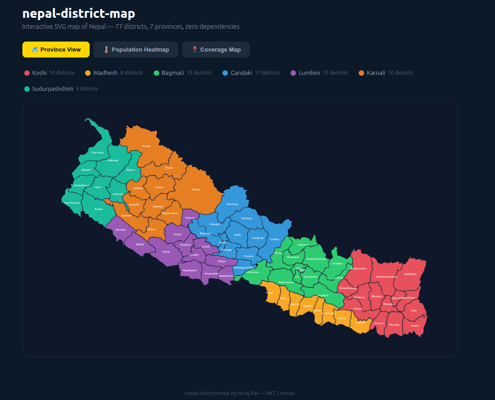

# nepal-district-map — Demo

Live demo for the [nepal-district-map](https://www.npmjs.com/package/nepal-district-map) npm package — an interactive SVG map of Nepal with all 77 districts and 7 provinces for React.

[](https://www.npmjs.com/package/nepal-district-map)
[](https://github.com/palniraj/nepal-district-map/blob/main/LICENSE)

---

## Demo Preview



### Video Walkthrough

https://github.com/user-attachments/assets/709b9f44-225d-4589-bde9-d9bb2d39106e

---

## Three Demo Modes

### 🗺️ Province View
All 77 districts colored by their province. Click any province in the legend to filter and highlight it. Click any district to see its name.

### 🌡️ Population Heatmap
Choropleth map using real Nepal census data. Districts are colored on a 5-stop scale from dark blue (low population) to red (high population). Hover any district to see the population figure.

### 📍 Coverage Map
Distribution network visualization — gold markers for distributor hubs, blue for covered districts, dark for expansion opportunities. Province-wise coverage ratio shown below the map.

---

## Run Locally

```bash
git clone https://github.com/palniraj/nepal-district-map-demo.git
cd nepal-district-map-demo
npm install
npm run dev
```

Open [http://localhost:5173](http://localhost:5173)

---

## Package

This demo uses the published npm package:

```bash
npm install nepal-district-map
```

→ [npmjs.com/package/nepal-district-map](https://www.npmjs.com/package/nepal-district-map)
→ [github.com/palniraj/nepal-district-map](https://github.com/palniraj/nepal-district-map)

---

## Author

**Niraj Pal**
- 🌐 [nirajpal.com.np](https://nirajpal.com.np/)
- 🐙 [@palniraj](https://github.com/palniraj)
- 💼 [LinkedIn](https://www.linkedin.com/in/niraj-pal/)
- 🔧 [Upwork](https://www.upwork.com/freelancers/nirajpal)

## License

MIT © 2025 Niraj Pal
